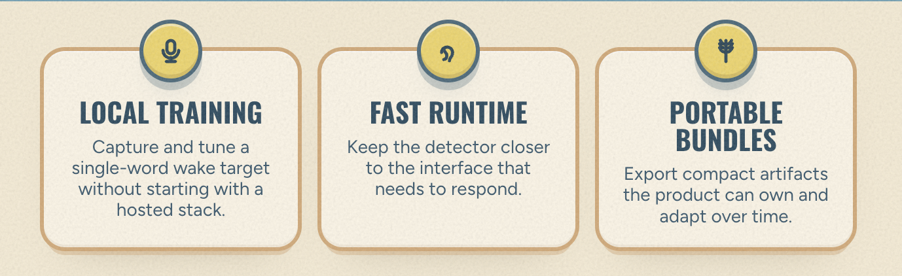
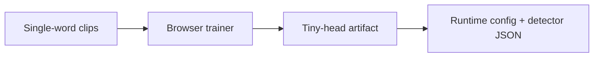
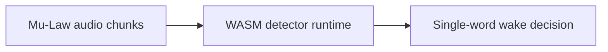
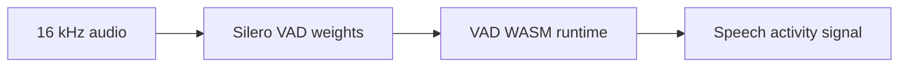

<p align="center">
  
</p>

<h1 align="center">waker</h1>

<p align="center">
  Single-word browser wake detection for the Waker web stack.
</p>

<p align="center">
  <a href="https://github.com/workspaces-team/waker/actions/workflows/ci.yml"></a>
  <a href="https://github.com/workspaces-team/waker/actions/workflows/version-policy.yml"></a>
</p>

<p align="center">
  <code>@workspaces-team/waker-config</code> for local browser training.
  <code>@workspaces-team/waker-vad</code> for standalone VAD assets.
  <code>@workspaces-team/waker-web</code> for fast on-device detection.
</p>

This public mirror is intentionally narrow. It exists to publish and maintain the browser-facing
single-word wake packages, plus the mirrored Rust runtimes they need.

Website: `https://waker.live`  
Issues: `https://github.com/workspaces-team/waker/issues`

## Why This Repo Exists

- train and tune a single-word wake target in the browser
- run a compact WASM-backed detector close to the user interface
- publish portable runtime bundles the product can own and evolve

## Packages

| Package | Purpose | Install |
| --- | --- | --- |
| [`@workspaces-team/waker-config`](https://www.npmjs.com/package/@workspaces-team/waker-config) | Train and serialize single-word tiny heads in the browser | `npm install @workspaces-team/waker-config` |
| [`@workspaces-team/waker-vad`](https://www.npmjs.com/package/@workspaces-team/waker-vad) | Ship standalone browser VAD runtime assets | `npm install @workspaces-team/waker-vad` |
| [`@workspaces-team/waker-web`](https://www.npmjs.com/package/@workspaces-team/waker-web) | Run single-word wake detection in the browser | `npm install @workspaces-team/waker-web` |

## Quick Start

```bash
pnpm install
pnpm run verify
```

Generate a starter single-word registration config:

```bash
npx @workspaces-team/waker-config --keyword "Operator"
```

Load the bundled single-word detector runtime:

```ts
import {
  createWakerWebDetector,
  getBundledWakerRegistrationUrl,
} from "@workspaces-team/waker-web";

const detector = createWakerWebDetector();
await detector.load(getBundledWakerRegistrationUrl("single_word_only"));
```

## Package Flows

### `@workspaces-team/waker-config`



### `@workspaces-team/waker-web`



### `@workspaces-team/waker-vad`



## What Lives Here

### `@workspaces-team/waker-config`

The training and artifact side of the browser stack:

- single-word tiny-head config generation
- browser/WASM-backed head training
- head artifact serialization
- trainer-side runtime helpers

Docs: <https://github.com/workspaces-team/waker/tree/main/packages/waker-config#readme>

### `@workspaces-team/waker-vad`

The standalone VAD asset package:

- mirrored Silero VAD WASM runtime
- mirrored VAD weight bundle
- Vite runtime asset plugin

Docs: <https://github.com/workspaces-team/waker/tree/main/packages/waker-vad#readme>

### `@workspaces-team/waker-web`

The detector side of the browser stack:

- bundled single-word detector runtime
- custom trained-head loading
- Vite runtime asset plugin
- vendored runtime assets for the active single-word surface

Docs: <https://github.com/workspaces-team/waker/tree/main/packages/waker-web#readme>

### `rust/sdk-wasm`

Mirrored Rust source for the detector WASM runtime and backbone weight bundle used by the public
browser packages. `pkg/` is generated locally and not committed.

### `rust/vad-wasm`

Mirrored Rust source for the Silero VAD WASM runtime used by `@workspaces-team/waker-vad`. `pkg/`
is generated locally and not committed.

## Workspace Layout

```text
packages/
  waker-config/
  waker-vad/
  waker-web/
rust/
  sdk-wasm/
  vad-wasm/
```

## Maintainer Flow

Refresh mirrored sources and runtime manifests:

```bash
pnpm run sync:sdk-wasm:source
pnpm run sync:vad-wasm:source
pnpm run waker-config:sync:runtime-assets
pnpm run waker-vad:sync:runtime
pnpm run waker-web:sync:runtime-assets
```

Build the mirrored Rust runtimes locally:

```bash
pnpm run sdk-wasm:build:release
pnpm run vad-wasm:build:release
```

Run the local repo gates:

```bash
pnpm run verify
pnpm run version:check:pr -- --base-ref origin/main
```

## Design Constraints

- The public scope is single-word wake detection only.
- The browser packages are first-class and publishable on their own.
- The Rust runtimes are mirrored so release builds can stay mechanical.
- GitHub Actions enforce CI and pull-request version policy.

More repo docs:

- [`CONTRIBUTING.md`](./CONTRIBUTING.md)
- [`RELEASING.md`](./RELEASING.md)
